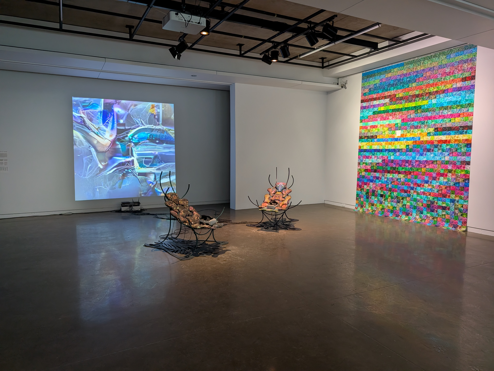

# Devenir partagé, pratiques de l'IA

>(photo: GG)

## Date de visite : 29 Janvier 2026

## Lieu
 

>Galerie Université de Montréal (photo: YV)

## Titre de l'oeuvre

>Marie-Êve Levasseur : *Techno-Compost 01 et 02*, 2025 (photo: YV)

 

## Description
         

>Cartel et texte expicatif de l'oeuvre

